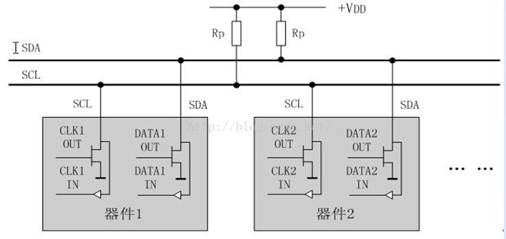
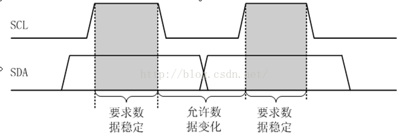
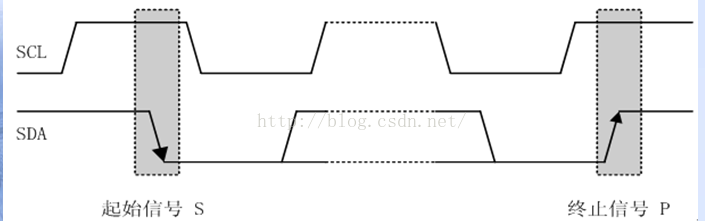
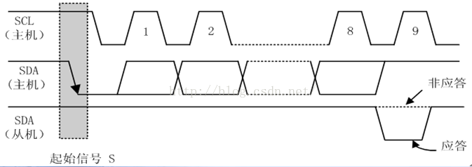
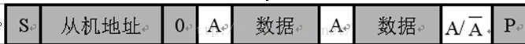
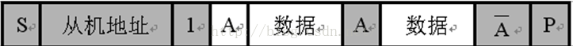
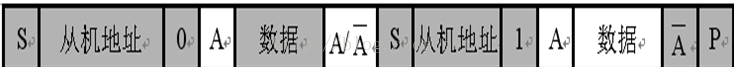
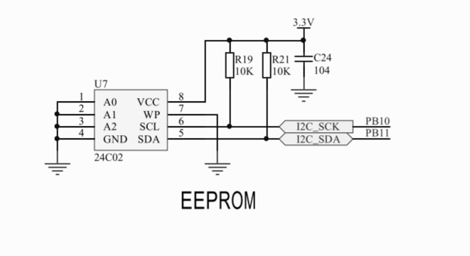
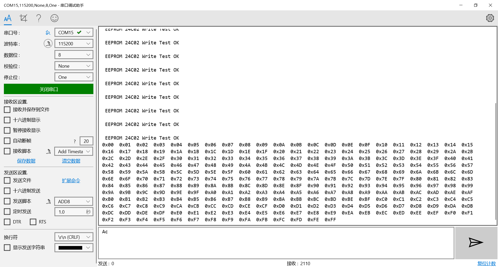

# IIC

术语|描述
:--:|:--:
发送器|发送数据到总线的器件
接收器|从总线接收数据的器件
主机|初始化发送产生时钟信号和终止发送的器件
从机|被主机寻址的器件
多主机| 同时有多于一个主机尝试控制总线但不破坏报文
仲裁|是一个在有多个主机同时尝试控制总线但只允许其中一个控制总线并使报文不被破坏的过程
同步|两个或多个器件同步时钟信号的过程

IIC:两线式串行总线，它是由**数据线SDA**和**时钟线SCL**构成的串行总线，可发送和接收数据。

在CPU与被控IC之间、IC与IC之间进行双向传送，高速IIC总线一般可达400kbs以上。

IIC是半双工通信方式。

## IIC的物理层

**时钟线SCL：在通信过程起到控制作用。**
**数据线SDA：用来一位一位的传送数据。**

每个连接到总线的器件都可以通过唯一的地址和其它器件通信，主机/从机角色和地址可配置，主机可以作为主机发送器和主机接收器。

IIC是真正的多主机总线，（**而这个SPI在每次通信前都需要把主机定死，而IIC可以在通讯过程中，改变主机**），如果两个或更多的主机同时请求总线，可以通过冲突检测和仲裁防止总线数据被破坏。

传输速率在标准模式下可以达到100kb/s,快速模式下可以达到400kb/s,高速模式下可达到3.4Mbit/s。 连接到总线的接口数量只由总线电容 400pF的限制决定。

片上的滤波器可以滤去总线数据线上的毛刺波保证数据完整。




### IIC总线线路的走线方式
```
一般来说走线必须使总线线路的串扰和干扰最小。
　　如果PCB 板的总线长度或带状电缆超过10cm， 包括VDD 和VSS 线配线方式必须是：
　　SDA _______________________
　　VDD _______________________
　　VSS _______________________
　　SCL _______________________

　　如果只有VSS 线那么配线方式必须是：
　　SDA _______________________
　　VSS _______________________
　　SCL _______________________
　　如果PCB 用了VSS层和VDD层,VDD和VSS 线可忽略。
```
### IIC分为软件IIC和硬件IIC

```
软件IIC：软件IIC通信指的是用单片机的两个I/O端口模拟出来的IIC，用软件控制管脚状态以模拟I2C通信波形，软件模拟寄存器的工作方式。

硬件IIC：一块硬件电路，硬件I2C对应芯片上的I2C外设，有相应I2C驱动电路，其所使用的I2C管脚也是专用的，硬件（固件）I2C是直接调用内部寄存器进行配置。

硬件I2C的效率要远高于软件的，而软件I2C由于不受管脚限制，接口比较灵活。
```


## IIC的协议层

### 数据的时效性
  在时钟的高电平周期内，SDA线上的数据必须保持稳定，数据线仅可以在时钟SCL为低电平时改变。



### 起始和结束条件

```
开始信号：当SCL为高期间，SDA由高到低的跳变；启动信号是一种电平跳变时序信号，而不是一个电平。
停止信号：当SCL为高期间，SDA由低到高的跳变；停止信号也是一种电平跳变时序信号，而不是一个电平信号。
```


### 应答

每当主机向从机发送完一个字节的数据，主机总是需要等待从机给出一个应答信号，以确认从机是否成功接收到了数据，从机应答主机所需要的时钟仍是主机提供的，应答出现在每一次主机完成8个数据位传输后紧跟着的时钟周期，低电平0表示应答，1表示非应答。



### 数据帧格式

I2C总线上传送的数据信号是广义的，既包括地址信号，又包括真正的数据信号。

在起始信号后必须传送一个从机的地址（7位），第8位是数据的传送方向位（R/T），用'0'表示主机发送数据(T)，'1'表示主机接收数据(R)。


比如在驱动MPU6050模块的时候，它写的MPU6050从机地址是0x68,
因为发送从机地址的时候，要加一位读写方向位，
刚开始应该是向这个MPU6050里写从机里某个寄存器的地址，所以应该是7位地址0x68(1101000)+二进制位0=11010000也就是0xD0,表示要向该IIC设备里写东西，然后再紧接着写入IIC设备里的寄存器地址

每次数据传送总是由主机产生的终止信号结束。

但是，若主机希望继续占用总线进行新的数据传送，则可以不产生终止信号，马上再次发出起始信号对另一从机进行寻址。

在总线的一次数据传输过程中，可以有以下几种组合方式：

**[1]主机向从机发送数据，数据传送方向在整个传送过程中不变：**


**[2]主机在第一个字节后，立即从从机读数据:**


**[3]在传送过程中，当需要改变传送方向时，起始信号和从机地址都被重复产生一次，但两次读/写方向位正好反相：**



一般情况下，[3]是比较常见的，比如MPU6050模块，
发送起始信号
等待从机应答
写一个从机地址+0(表示写)，
等待从机应答
发送一个字节的MPU6050加速度存储寄存器地址，
等待从机应答
再发送一次起始信号
等待从机应答
写一个从机地址+1（表示读）
等待从机应答
读取MPU6050传感器数据
主机非应答


### STM32下配置IIC (AT24C02 IIC 通信)

硬件连接

注意：**一定要接上拉电阻！！！**



```
HAL_I2C_Mem_Write(I2C_HandleTypeDef *hi2c, uint16_t DevAddress, uint16_t MemAddress, uint16_t MemAddSize, uint8_t *pData, uint16_t Size, uint32_t Timeout);
/* 第1个参数为I2C操作句柄
   第2个参数为从机设备地址
   第3个参数为从机寄存器地址
   第4个参数为从机寄存器地址长度
   第5个参数为发送的数据的起始地址
   第6个参数为传输数据的大小 (实测最大为16)
   第7个参数为操作超时时间 　　*/
if(HAL_I2C_Mem_Write(&hi2c2, 0xA0, 16*j, I2C_MEMADD_SIZE_8BIT,WriteBuffer+16*j,16, 0xff) == HAL_OK)
```

```

HAL_StatusTypeDef HAL_I2C_Mem_Read(I2C_HandleTypeDef *hi2c, uint16_t DevAddress, uint16_t MemAddress, uint16_t MemAddSize, uint8_t *pData, uint16_t Size, uint32_t Timeout);
/* 第1个参数为I2C操作句柄
   第2个参数为从机设备地址
   第3个参数为从机寄存器地址
   第4个参数为从机寄存器地址长度
   第5个参数为发送的数据的起始地址
   第6个参数为传输数据的大小
   第7个参数为操作超时时间 　　*/
   HAL_I2C_Mem_Read(&hi2c2, 0xA1, 0, I2C_MEMADD_SIZE_8BIT,ReadBuffer,256, 0xff);
```
效果


>参考 https://bbs.21ic.com/icview-1128774-1-1.html

>参考 https://blog.csdn.net/zhanghuaichao/article/details/48266309

>参考 https://www.cnblogs.com/-wenli/p/10907967.html

>参考 https://blog.csdn.net/as480133937/article/details/105259075
