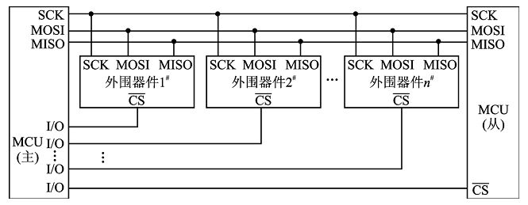
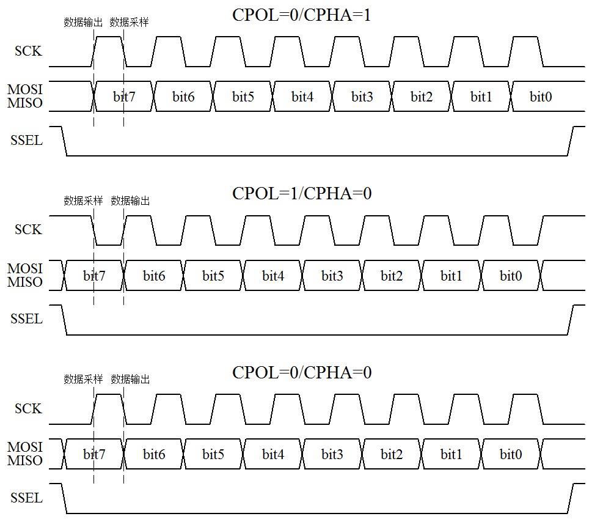
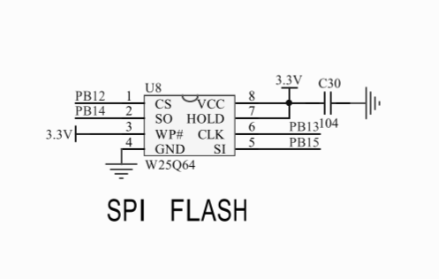
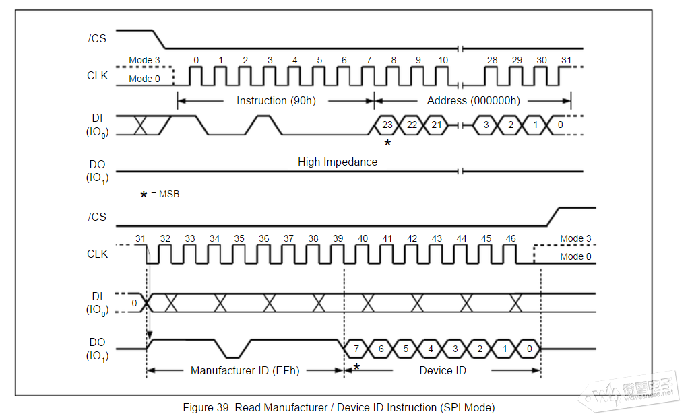
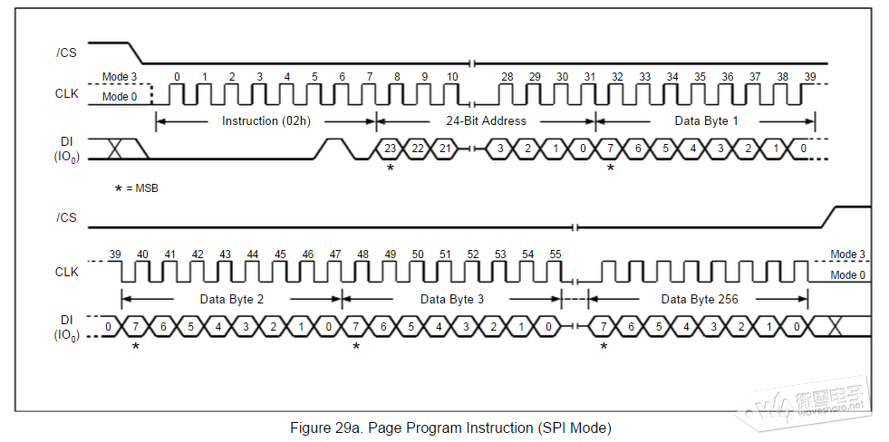
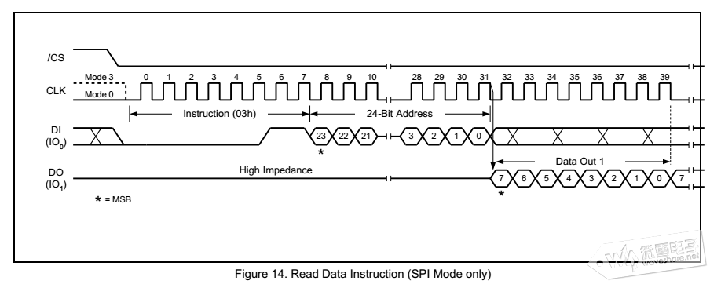
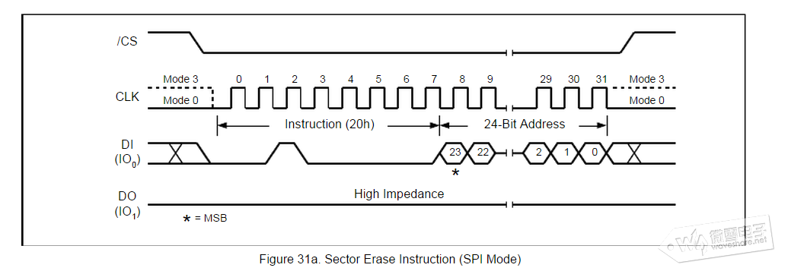
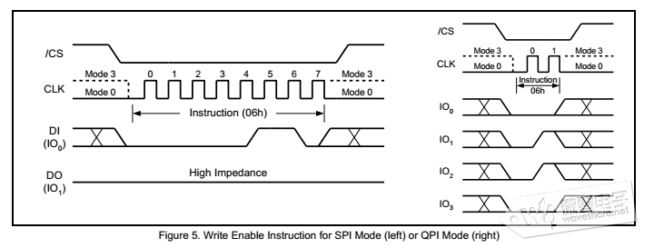
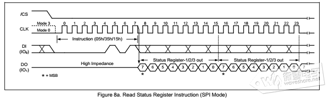
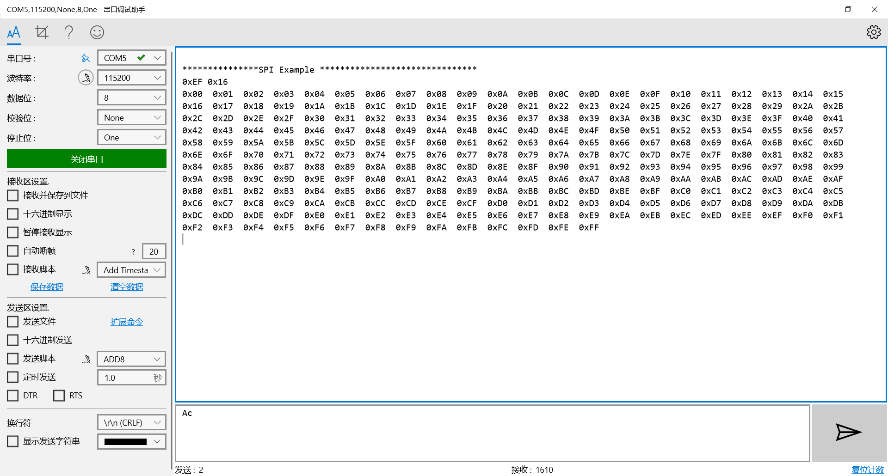

# SPI


SPI是一种高速的 全双工 同步的通信总线 数据传输速率快

```
SCK：主要的作用是 Master(主)设备往 Slave(从)设备传输时钟信号, 控制数据交换的时机以及速率；

SS/CS：用于 Master(主)设备片选 Slave (从)设备，使被选中的 Slave(从)设备能够被 Master(主)设备所访问；

SDO/MOSI：在 Master(主)上面也被称为 Tx-Channel，作为数据的出口，主要用于 SPI 设备发送数据；

SDI/MISO：在 Master(主)上面也被称为 Rx-Channel，作为数据的入口，主要用于SPI 设备接收数据；

```

## SPI 通信有四种模式 由CPOL和CPHA决定

CPOL： Clock Polarity，就是时钟的极性。通信的整个过程分为空闲时刻和通信时刻，如果 SCLK 在数据发送之前和之后的空闲状态是高电平，那么就是CPOL=1，如果空闲状态 SCLK 是低电平，那么就是 CPOL=0。

CPHA：Clock Phase，就是时钟的相位。

主机和从机要交换数据，就牵涉到一个问题，即主机在什么时刻输出数据到 MOSI 上而从机在什么时刻采样这个数据，或者从机在什么时刻输出数据到 MISO 上而主机什么时刻采样这个数据。同步通信的一个特点就是所有数据的变化和采样都是伴随着时钟沿进行的，也就是说数据总是在时钟的边沿附近变化或被采样。而一个时钟周期必定包含了一个上升沿和一个下降沿，这是周期的定义所决定的，只是这两个沿的先后并无规定。**又因为数据从产生的时刻到它的稳定是需要一定时间的，那么，如果主机在上升沿输出数据到 MOSI 上，从机就只能在下降沿去采样这个数据了。反之如果一方在下降沿输出数据，那么另一方就必须在上升沿采样这个数据。**

CPHA=1，就表示数据的输出是在一个时钟周期的第一个沿上，至于这个沿是上升沿还是下降沿，这要视 CPOL 的值而定，CPOL=1 那就是下降沿，反之就是上升沿。那么数据的采样自然就是在第二个沿上了。

CPHA=0，就表示数据的采样是在一个时钟周期的第一个沿上，同样它是什么沿由 CPOL决定。那么数据的输出自然就在第二个沿上了。仔细想一下，这里会有一个问题：就是当一帧数据开始传输第一个 bit 时，在第一个时钟沿上就采样该数据了，那么它是在什么时候输出来的呢？有两种情况：一是 SSEL 使能的边沿，二是上一帧数据的最后一个时钟沿，有时两种情况还会同时生效。

以 CPOL=1/CPHA=1 为例


当数据未发送时以及发送完毕后，SCK 都是高电平，因此 CPOL=1。
可以看出，在 SCK 第一个沿的时候，MOSI 和 MISO 会发生变化，同时 SCK 第二个沿的时候，数据是稳定的，此刻采样数据是合适的，也就是上升沿即一个时钟周期的后沿锁存读取数据，即 CPHA=1。注意最后最隐蔽的 SSEL 片选，这个引脚通常用来决定是哪个从机和主机进行通信。



在时序上，SPI 是不是比 I2C要简单的多？没有了起始、停止和应答，UART 和 SPI 在通信的时候，只负责通信，不管是否通信成功，而 I2C却要通过应答信息来获取通信成功失败的信息，所以相对来说，UART 和 SPI 的时序都要比 I2C简单一些。

## STM32下配置SPI (Flash W25Q64 SPI 通信)


W25Q64 容量为64Mbits 也就是 8*1024KB ，所以很容易计算出整个存储空间的地址范围：0x000000~0x7FFFFF

W25Q64将8m字节的容量分为128个块，每个块大小为64K字节，每个块又分为16个扇区，每个扇区4K个字节

W25Q64的最小擦除单位为一个扇区，也就是每次必须擦除4K个字节。所以，这需要给W25Q64开辟一个至少4K的缓存区，这样必须要求芯片有4K以上的SRAM才能有很好的操作。

```
读制造商/设备ID（90）

    该指令通常在调试程序的时候用到，判断SPI通信是否正常。该指令通过主器件拉低/CS片选使能器件开始传输，首先通过DI线传输“90H”指令，接着传输000000H的24位地址（A23-A0），之后从器件会通过DO线返回制造商ID（EFH）和设备ID(16H)。
（注：SPI为数据交换通信，主器件在发送“90H”指令时也会接收到一个字节FFH，但此数据为无效数据）
```

```
页编程（02H）

    页编程指令可以在已擦除的存储单元中写入256个字节。该指令先拉低/CS引脚电平，接着传输“02H”指令和24位地址。后面接着传输至少一个数据字节，最多256字节。写数据前先使能写操作。
```

```
读数据（03H）

    读数据指令可从存储器依次一个或多个数据字节，该指令通过主器件拉低/CS电平使能设备开始传输，然后传输“03H”指令，接着通过DI管脚传输24位地址，从器件接到地址后，寻址存储器中的数据通过DO引脚输出。每传输一个字节地址自动递增，所以只要时钟继续传输，可以不断读取存储器中的数据。
```



```
扇区擦除（20H）

    扇区擦除指令，数据写入前必须擦除对应的存储单元，该指令先拉低/CS引脚电平,接着传输'20H'指令和要擦除扇区的地址。
```


```
写使能命令（06H）
```


```
读状态寄存器1(05H)，状态寄存器2（35H）,状态寄存器3（15H）
```


```
HAL_StatusTypeDef HAL_SPI_Transmit(SPI_HandleTypeDef *hspi, uint8_t *pData, uint16_t Size, uint32_t Timeout)
/* 第1个参数为SPI操作句柄
   第2个参数为数据的起始地址
   第3个参数为传输数据的大小
   第4个参数为操作超时时间 　　*/
```

```
HAL_StatusTypeDef HAL_SPI_Receive(SPI_HandleTypeDef *hspi, uint8_t *pData, uint16_t Size, uint32_t Timeout)
/* 第1个参数为SPI操作句柄
   第2个参数为数据的起始地址
   第3个参数为传输数据的大小
   第4个参数为操作超时时间 　　*/
```
结果如下

>参考 http://c.biancheng.net/cpp/html/1946.html

>参考 https://www.waveshare.net/study/article-649-1.html

>参考 https://www.waveshare.net/study/article-650-1.html
